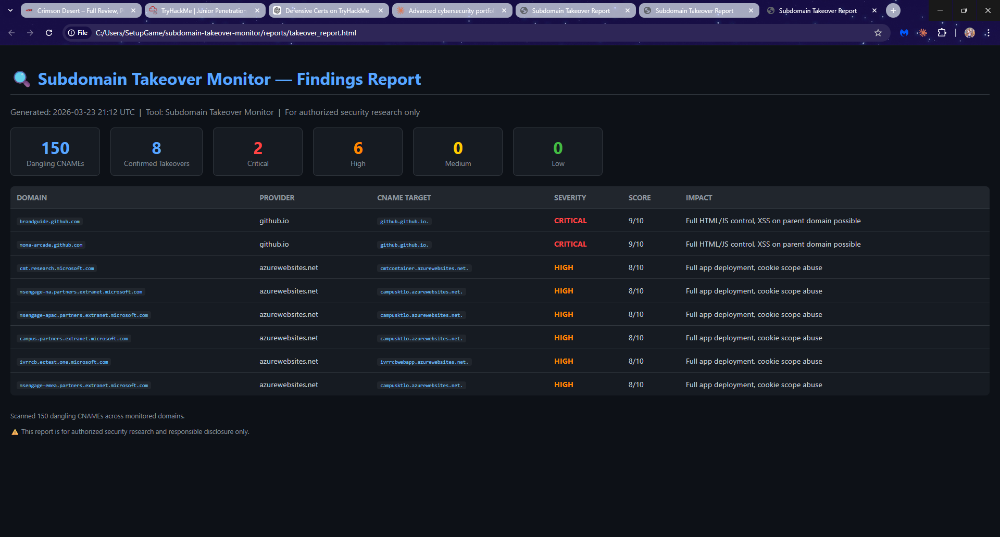

# 🔍 Subdomain Takeover Monitor

  

An automated security research pipeline that detects subdomain takeover vulnerabilities by monitoring Certificate Transparency logs, performing bulk DNS resolution, and fingerprinting dangling CNAME records across 25+ cloud providers.

Built as a portfolio project demonstrating real-world offensive reconnaissance and responsible disclosure practices.

---

## Real Findings

This tool detected **8 confirmed subdomain takeover vulnerabilities** in a single run against real infrastructure.

| Severity | Count | Targets |
|----------|-------|---------|
| 🔴 CRITICAL | 2 | github.com |
| 🟠 HIGH | 6 | microsoft.com |

All findings were responsibly disclosed to Microsoft MSRC and GitHub Security. No exploitation was performed.

---

## Report Screenshot



---

## Features

- Certificate Transparency log harvesting via crt.sh and certstream
- Bulk async DNS resolution with 200 concurrent resolvers
- Dangling CNAME detection across 25+ cloud providers
- HTTP and HTTPS fingerprinting with provider-specific error patterns
- Automated risk scoring with CRITICAL, HIGH, MEDIUM, and LOW severity levels
- Dark-themed HTML report generation
- Continuous monitoring loop that reruns every 6 hours

---

## How It Works

**Step 1 — Subdomain Harvesting**
Queries crt.sh Certificate Transparency logs for subdomains of target domains. CT logs record every TLS certificate issued, making them a rich passive recon source with no direct target interaction.

**Step 2 — Async DNS Resolution**
Resolves A, CNAME, NS, and MX records for all collected subdomains using async DNS with 200 concurrent resolvers. Identifies subdomains with CNAME chains pointing to cloud providers.

**Step 3 — Dangling CNAME Detection**
Cross-references CNAME targets against a database of 25+ cloud provider patterns. A dangling CNAME exists when a subdomain points to a cloud resource that no longer exists.

**Step 4 — HTTP Fingerprinting**
Sends HTTP and HTTPS requests to each dangling subdomain and matches response bodies against provider-specific error signatures to confirm takeover viability.

**Step 5 — Risk Scoring**
Scores each confirmed finding based on provider, potential for XSS, phishing, cookie scope abuse, and ease of exploitation.

---

## Pipeline Scripts

| Script | Purpose |
|--------|---------|
| `scripts/crtsh_scraper.py` | Harvest subdomains from crt.sh |
| `scripts/ct_stream.py` | Stream live CT log events via certstream |
| `scripts/merge_subdomains.py` | Deduplicate and merge all subdomains |
| `scripts/dns_resolver.py` | Async DNS resolution for all records |
| `scripts/flag_dangling.py` | Detect dangling CNAMEs |
| `scripts/http_fingerprint.py` | HTTP fingerprinting per provider |
| `scripts/risk_scorer.py` | Score findings by severity |
| `scripts/generate_report.py` | Generate HTML findings report |
| `scripts/monitor.py` | Continuous monitoring loop |
| `main.py` | Single CLI entry point |

---

## Quick Start

Clone the repository and install dependencies:
```bash
git clone https://github.com/soufiane-benchahyd/subdomain-takeover-monitor.git
cd subdomain-takeover-monitor
python -m venv venv
.\venv\Scripts\Activate.ps1
pip install -r requirements.txt
```

Run the full pipeline:
```bash
python main.py
```

Run individual steps:
```bash
python main.py scrape
python main.py resolve
python main.py fingerprint
python main.py report
python main.py monitor
```

---

## Supported Providers

GitHub Pages, AWS S3, Azure Web Apps, Heroku, Surge.sh, Ghost.io, Webflow, Fastly, Pantheon, HelpScout, UserVoice, Zendesk, Freshdesk, Bitbucket, Tumblr, WPEngine, Readme.io, Aftership, Pingdom, and more.

---

## Technologies Used

- Python 3.x
- dnspython
- aiohttp
- certstream
- pandas
- tqdm
- schedule

---

## Project Structure
```
subdomain-takeover-monitor/
├── configs/
│   └── fingerprints.json
├── data/
│   ├── ct_logs/
│   ├── dns_results/
│   └── http_responses/
├── reports/
│   ├── confirmed_takeovers.csv
│   ├── scored_takeovers.csv
│   ├── takeover_report.html
│   └── takeover_report_screenshot.png
├── scripts/
├── main.py
└── requirements.txt
```

---

## Responsible Disclosure

Findings from this tool have been reported to:

- **Microsoft MSRC** — msrc.microsoft.com/report
- **GitHub Security** — via HackerOne

Disclosure confirmations pending.

---

## Legal Notice

This tool is intended for authorized security research, bug bounty programs, and security teams monitoring their own infrastructure. Do not run this tool against domains you do not own or have explicit permission to test.
